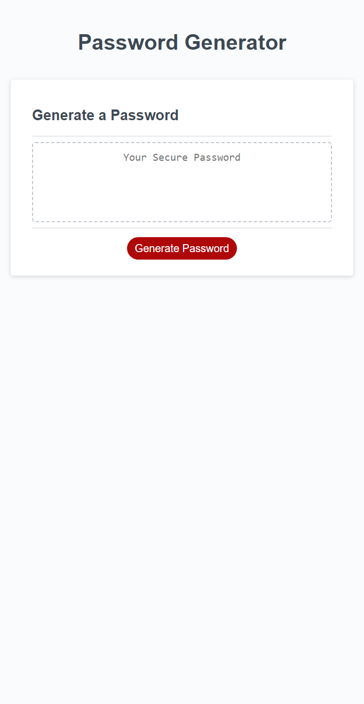

# Password Generator

## Description

This webpage offers a way for users in need of a secure password to generate one at random using whatever password criteria they want so that they do not have to think of one themselves. By creating this project I learned how to use variables in a way to transport data and how to insert new data into an existing variable. Example being to take the user's responses and insert the corresponding arrays into their own seperate array so that it can be used to generate the password.

## Screeenshot

## Link to page

https://midasantiago.github.io/password-generator/